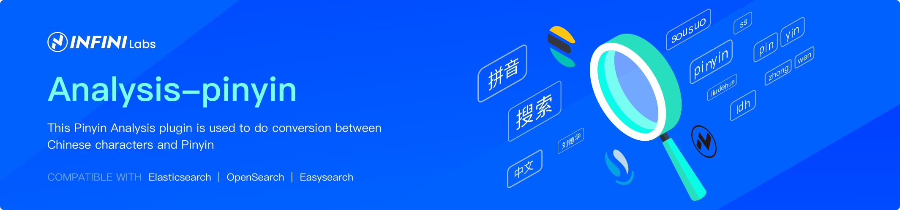

Pinyin Analysis for Elasticsearch and OpenSearch
==================================

This Pinyin Analysis plugin facilitates the conversion between Chinese characters and Pinyin. It supports major versions of Elasticsearch and OpenSearch. Maintained and supported with ❤️ by INFINI Labs.

The plugin comprises an analyzer named `pinyin`, a tokenizer named `pinyin`, and a token filter named `pinyin`.

# Optional Parameters

- `keep_first_letter`: When enabled, retains only the first letter of each Chinese character. For example, `刘德华` becomes `ldh`. Default: true.

- `keep_separate_first_letter`: When enabled, keeps the first letters of each Chinese character separately. For example, `刘德华` becomes `l`,`d`,`h`. Default: false. Note: This may increase query fuzziness due to term frequency.

- `limit_first_letter_length`: Sets the maximum length of the first letter result. Default: 16.

- `keep_full_pinyin`: When enabled, preserves the full Pinyin of each Chinese character. For example, `刘德华` becomes [`liu`,`de`,`hua`]. Default: true.

- `keep_joined_full_pinyin`: When enabled, joins the full Pinyin of each Chinese character. For example, `刘德华` becomes [`liudehua`]. Default: false.

- `keep_none_chinese`: Keeps non-Chinese letters or numbers in the result. Default: true.

- `keep_none_chinese_together`: Keeps non-Chinese letters together. Default: true. For example, `DJ音乐家` becomes `DJ`,`yin`,`yue`,`jia`. When set to `false`, `DJ音乐家` becomes `D`,`J`,`yin`,`yue`,`jia`. Note: `keep_none_chinese` should be enabled first.

- `keep_none_chinese_in_first_letter`: Keeps non-Chinese letters in the first letter. For example, `刘德华AT2016` becomes `ldhat2016`. Default: true.

- `keep_none_chinese_in_joined_full_pinyin`: Keeps non-Chinese letters in joined full Pinyin. For example, `刘德华2016` becomes `liudehua2016`. Default: false.

- `none_chinese_pinyin_tokenize`: Breaks non-Chinese letters into separate Pinyin terms if they are Pinyin. Default: true. For example, `liudehuaalibaba13zhuanghan` becomes `liu`,`de`,`hua`,`a`,`li`,`ba`,`ba`,`13`,`zhuang`,`han`. Note: `keep_none_chinese` and `keep_none_chinese_together` should be enabled first.

- `keep_original`: When enabled, keeps the original input as well. Default: false.

- `lowercase`: Lowercases non-Chinese letters. Default: true.

- `trim_whitespace`: Default: true.

- `remove_duplicated_term`: When enabled, removes duplicated terms to save index space. For example, `de的` becomes `de`. Default: false. Note: Position-related queries may be influenced.

- `ignore_pinyin_offset`: After version 6.0, offsets are strictly constrained, and overlapped tokens are not allowed. With this parameter, overlapped tokens will be allowed by ignoring the offset. Please note, all position-related queries or highlights will become incorrect. You should use multi-fields and specify different settings for different query purposes. If you need offsets, please set it to false. Default: true.

# Quick Start

1.Create a index with custom pinyin analyzer
<pre>
PUT /medcl/ 
{
    "settings" : {
        "analysis" : {
            "analyzer" : {
                "pinyin_analyzer" : {
                    "tokenizer" : "my_pinyin"
                    }
            },
            "tokenizer" : {
                "my_pinyin" : {
                    "type" : "pinyin",
                    "keep_separate_first_letter" : false,
                    "keep_full_pinyin" : true,
                    "keep_original" : true,
                    "limit_first_letter_length" : 16,
                    "lowercase" : true,
                    "remove_duplicated_term" : true
                }
            }
        }
    }
}
</pre>

2.Test Analyzer, analyzing a chinese name, such as 刘德华
<pre>
GET /medcl/_analyze
{
  "text": ["刘德华"],
  "analyzer": "pinyin_analyzer"
}</pre>
<pre>
{
  "tokens" : [
    {
      "token" : "liu",
      "start_offset" : 0,
      "end_offset" : 1,
      "type" : "word",
      "position" : 0
    },
    {
      "token" : "de",
      "start_offset" : 1,
      "end_offset" : 2,
      "type" : "word",
      "position" : 1
    },
    {
      "token" : "hua",
      "start_offset" : 2,
      "end_offset" : 3,
      "type" : "word",
      "position" : 2
    },
    {
      "token" : "刘德华",
      "start_offset" : 0,
      "end_offset" : 3,
      "type" : "word",
      "position" : 3
    },
    {
      "token" : "ldh",
      "start_offset" : 0,
      "end_offset" : 3,
      "type" : "word",
      "position" : 4
    }
  ]
}
</pre>

3.Create mapping
<pre>
POST /medcl/_mapping 
{
        "properties": {
            "name": {
                "type": "keyword",
                "fields": {
                    "pinyin": {
                        "type": "text",
                        "store": false,
                        "term_vector": "with_offsets",
                        "analyzer": "pinyin_analyzer",
                        "boost": 10
                    }
                }
            }
        }
    
}
</pre>

4.Indexing
<pre>
POST /medcl/_create/andy
{"name":"刘德华"}
</pre>

5.Let's search

<pre>

curl http://localhost:9200/medcl/_search?q=name:%E5%88%98%E5%BE%B7%E5%8D%8E
curl http://localhost:9200/medcl/_search?q=name.pinyin:%e5%88%98%e5%be%b7
curl http://localhost:9200/medcl/_search?q=name.pinyin:liu
curl http://localhost:9200/medcl/_search?q=name.pinyin:ldh
curl http://localhost:9200/medcl/_search?q=name.pinyin:de+hua

</pre>

6.Using Pinyin-TokenFilter
<pre>
PUT /medcl1/ 
{
    "settings" : {
        "analysis" : {
            "analyzer" : {
                "user_name_analyzer" : {
                    "tokenizer" : "whitespace",
                    "filter" : "pinyin_first_letter_and_full_pinyin_filter"
                }
            },
            "filter" : {
                "pinyin_first_letter_and_full_pinyin_filter" : {
                    "type" : "pinyin",
                    "keep_first_letter" : true,
                    "keep_full_pinyin" : false,
                    "keep_none_chinese" : true,
                    "keep_original" : false,
                    "limit_first_letter_length" : 16,
                    "lowercase" : true,
                    "trim_whitespace" : true,
                    "keep_none_chinese_in_first_letter" : true
                }
            }
        }
    }
}
</pre>

Token Test:刘德华 张学友 郭富城 黎明 四大天王
<pre>
GET /medcl1/_analyze
{
  "text": ["刘德华 张学友 郭富城 黎明 四大天王"],
  "analyzer": "user_name_analyzer"
}
</pre>
<pre>
{
  "tokens" : [
    {
      "token" : "ldh",
      "start_offset" : 0,
      "end_offset" : 3,
      "type" : "word",
      "position" : 0
    },
    {
      "token" : "zxy",
      "start_offset" : 4,
      "end_offset" : 7,
      "type" : "word",
      "position" : 1
    },
    {
      "token" : "gfc",
      "start_offset" : 8,
      "end_offset" : 11,
      "type" : "word",
      "position" : 2
    },
    {
      "token" : "lm",
      "start_offset" : 12,
      "end_offset" : 14,
      "type" : "word",
      "position" : 3
    },
    {
      "token" : "sdtw",
      "start_offset" : 15,
      "end_offset" : 19,
      "type" : "word",
      "position" : 4
    }
  ]
}
</pre>

7.Used in phrase query

- option 1

<pre>
PUT /medcl2/
{
    "settings" : {
        "analysis" : {
            "analyzer" : {
                "pinyin_analyzer" : {
                    "tokenizer" : "my_pinyin"
                    }
            },
            "tokenizer" : {
                "my_pinyin" : {
                    "type" : "pinyin",
                    "keep_first_letter":false,
                    "keep_separate_first_letter" : false,
                    "keep_full_pinyin" : true,
                    "keep_original" : false,
                    "limit_first_letter_length" : 16,
                    "lowercase" : true
                }
            }
        }
    }
}
GET /medcl2/_search
{
  "query": {"match_phrase": {
    "name.pinyin": "刘德华"
  }}
}

</pre>

- option 2

<pre>
 
PUT /medcl3/
{
   "settings" : {
       "analysis" : {
           "analyzer" : {
               "pinyin_analyzer" : {
                   "tokenizer" : "my_pinyin"
                   }
           },
           "tokenizer" : {
               "my_pinyin" : {
                   "type" : "pinyin",
                   "keep_first_letter":true,
                   "keep_separate_first_letter" : true,
                   "keep_full_pinyin" : true,
                   "keep_original" : false,
                   "limit_first_letter_length" : 16,
                   "lowercase" : true
               }
           }
       }
   }
}
   
POST /medcl3/_mapping 
{
  "properties": {
      "name": {
          "type": "keyword",
          "fields": {
              "pinyin": {
                  "type": "text",
                  "store": false,
                  "term_vector": "with_offsets",
                  "analyzer": "pinyin_analyzer",
                  "boost": 10
              }
          }
      }
  }
}
  
   
GET /medcl3/_analyze
{
   "text": ["刘德华"],
   "analyzer": "pinyin_analyzer"
}
 
POST /medcl3/_create/andy
{"name":"刘德华"}

GET /medcl3/_search
{
 "query": {"match_phrase": {
   "name.pinyin": "刘德h"
 }}
}

GET /medcl3/_search
{
 "query": {"match_phrase": {
   "name.pinyin": "刘dh"
 }}
}

GET /medcl3/_search
{
 "query": {"match_phrase": {
   "name.pinyin": "liudh"
 }}
}

GET /medcl3/_search
{
 "query": {"match_phrase": {
   "name.pinyin": "liudeh"
 }}
}

GET /medcl3/_search
{
 "query": {"match_phrase": {
   "name.pinyin": "liude华"
 }}
}

</pre>

8.That's all, have fun.

# Community

Fell free to join the Discord server to discuss anything around this project: 

[https://discord.gg/4tKTMkkvVX](https://discord.gg/4tKTMkkvVX)

# License

Copyright ©️ INFINI Labs.

Licensed under the Apache License, Version 2.0 (the "License");
you may not use this file except in compliance with the License.
You may obtain a copy of the License at

    http://www.apache.org/licenses/LICENSE-2.0

Unless required by applicable law or agreed to in writing, software
distributed under the License is distributed on an "AS IS" BASIS,
WITHOUT WARRANTIES OR CONDITIONS OF ANY KIND, either express or implied.
See the License for the specific language governing permissions and
limitations under the License.
